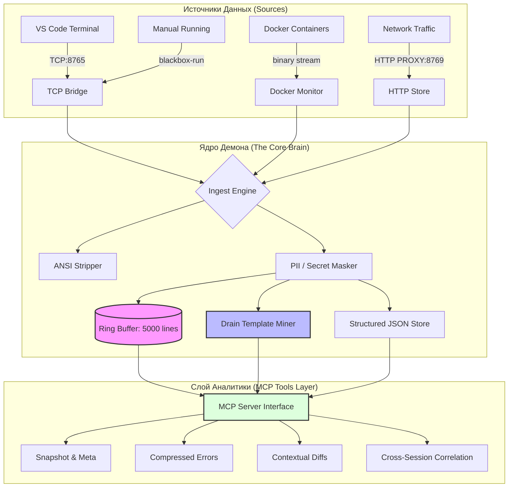

# 🏗️ BlackBox: Карта Архитектуры и Функционала
> Полный технический вижн проекта для Solo-Founder. Версия 1.2 (Actualized)

Этот документ представляет собой "вид сверху" на всё, что реально работает в коде BlackBox на текущий момент. Он разделен на слои: от "железа" (сбора данных) до "интеллекта" (инструментов для ИИ).

---

## 🗺️ Общая схема системы

---

## 🛠️ Функциональная Классификация

Я разделил все инструменты на 4 "эшелона", чтобы было понятно, как они наслаиваются друг на друга.

### 📦 Эшелон 1: Базовый Контекст (The Reality)
Это инструменты, которые дают ИИ "глаза" внутри вашего редактора и файлов.

*   **`get_snapshot`**: "Карта местности". Показывает время работы, тип проекта (Rust/JS/etc), ветку Git и количество измененных файлов.
*   **`get_terminal_buffer`**: "Что я вижу". Сырой (но очищенный от мусора) текст из терминала. Поддерживает фильтрацию по PID процесса или названию терминала.
*   **`get_project_metadata`**: "Окружение". Список всех зависимостей из `package.json`/`Cargo.toml` и список ключей из `.env` (значения скрыты).
*   **`read_file`**: "Чтение кода". Позволяет ИИ прочитать любой файл в проекте с защитой от выхода за пределы папки (Path Traversal Protection).

### 🐳 Эшелон 2: Инфраструктурный контекст (The Machine)
Тут BlackBox выходит за пределы IDE и смотрит на то, что происходит в системе.

*   **`get_container_logs`**: Прямой доступ к логам Docker. Система сама находит работающие контейнеры и вытягивает из них только ошибки (`ERROR`/`WARN`), отбрасывая мусор.
*   **`get_http_errors`**: Отслеживает сетевые запросы через встроенный прокси (порт 8769). Если ваш бэкенд ответил 500-й ошибкой, ИИ узнает об этом моментально, не видя успешные запросы 200 OK.
*   **`get_process_logs`**: Если вы запустили команду через `blackbox-run`, её вывод сохраняется отдельно и доступен по этому инструменту.

### 🧠 Эшелон 3: Интеллектуальное Сжатие (The Wisdom)
Самая важная часть. Эти инструменты экономят ваши токены и не дают ИИ запутаться.

*   **`get_compressed_errors`**: **Гордость проекта.** Использует алгоритм *Drain* для группировки 10 000 одинаковых ошибок в одну строку: *"Ошибка X повторилась 5000 раз"*. Включает в себя автоматически извлеченные стектрейсы.
*   **`get_contextual_diff`**: "Хирургический дифф". Система смотрит на ошибки в терминале, понимает, в каких файлах они произошли, и показывает ИИ изменения **только в этих файлах**.
*   **`get_structured_context`**: Если ваши логи идут в JSON (tracing/structlog/pino), BlackBox парсит их и позволяет искать по `span_id`. Это киллер-фича для отладки асинхронных цепочек.

### ⏳ Эшелон 4: Ретроспектива и Корреляция (The Timeline)
Новейшие инструменты (из реализованной части Фазы 3).

*   **`get_postmortem`**: Создает таймлайн событий за последние N минут. Группирует логи по минутным сегментам, показывая всплески ошибок. Ответ на вопрос: *"Что именно начало ломаться 20 минут назад?"*.
*   **`get_correlated_errors`**: Ищет связь между терминалом, докером и сетью. Если в терминале упал тест, этот инструмент найдет ошибку в базе данных, которая произошла в ту же секунду (±5с).

---

## 📈 Качественные Характеристики (Current Health)

| Параметр | Состояние | Комментарий |
| :--- | :--- | :--- |
| **Скорость Ingest** | 🚀 Отличная | Код на Rust справляется с потоком логов без видимых задержек. |
| **Приватность** | 🛡️ Высокая | Все API-ключи и Email маскируются локально ПЕРЕД тем, как попасть в память. |
| **Стабильность** | 💎 Каменная | Демон работает как синглтон. Если запустить второй — он становится прокси и не мешает первому. |
| **Точность ИИ** | 🎯 Максимальная | Благодаря XML-обертке и сжатию, ИИ почти не галлюцинирует по поводу логов. |

---

## 📍 Куда масштабироваться?
Глядя на эту карту, видно, что BlackBox уже стал мощным "комбайном" для сбора данных. 
**Следующий шаг:** сделать его работу полностью автоматической (Native Interception), чтобы вам не нужно было настраивать VS Code или запускать `blackbox-run`. Это превратит проект из "инструмента" в "инфраструктуру".
